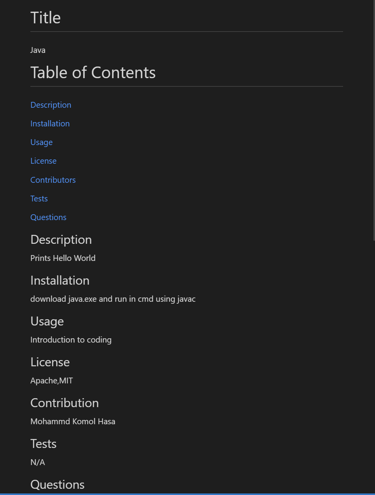

# Title
ReadMe Generator

# Table of Contents
[Description](#description)

[Installation](#instalation)

[Usage](#usage)

[License](#license)

[Contributors](#contributors)

[Tests](#tests)

[Questions](#questions)

## Description
This node.js app allows users to create README.md files from their command line

## Installation
Clone the directoy and use 'npm i' to install all dependencies, and from the terminal use 'node index' to run program

Link to guide video: https://drive.google.com/file/d/1uAjjBD_c0SOVuKqYjBQ8mON1NVYt7tGm/view

## Usage
Generate README files for any project

## License
N/A

## Contribution
Mohammad Komol Hasan

## Tests
N/A

## Questions
GitHub: MKHLink

Email: likhonhasankomol@gmail.com
    